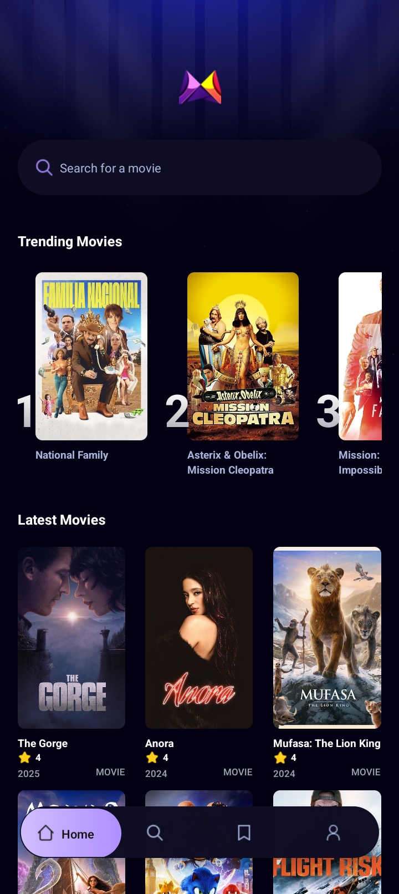
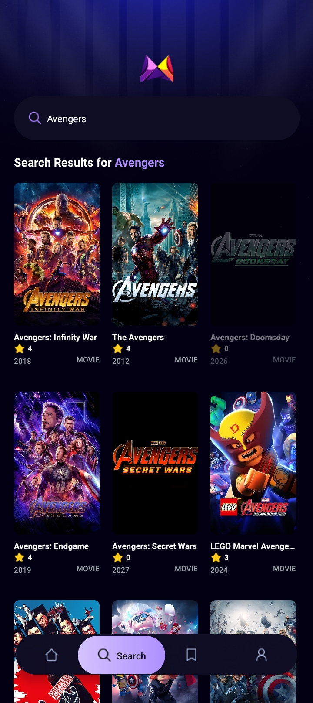

# PixelPlay 🎬

**PixelPlay** is an open-source movie app built with **React Native**, **Appwrite**, and **The Movie Database (TMDb)**. It allows users to explore movies, get detailed information, and manage their favorite lists seamlessly.

---

## 🚀 Features

- 🎥 Browse **Trending**, **Popular**, and **Upcoming Movies**
- 🔎 **Search** for Movies & TV Shows
- 📜 View **Movie Details** (Synopsis, Cast, Ratings, etc.)
- ❤️ **Save Movies** to Favorites
- 🌙 **Light & Dark Mode** Support
- 🛠 Built with **React Native**, **Expo**, **Appwrite**, and **TMDb**

---

## 🏗 Tech Stack

- **Frontend**: React Native, Expo, TailwindCSS
- **Backend**: Appwrite (for authentication, database, and storage)
- **API**: TMDb (for movie data)

----

📦 Installation
```sh
git clone https://github.com/shakibkhandev/PixelPlay.git PixelPlay
cd PixelPlay
npm install
npx expo start
```

🏗 Build APK
```sh
npm i -g eas-cli
```
```sh
eas login
```
```
eas build:configure
```
```
eas build --profile production --platform android
```


---

## 📱 Mobile View

<div style="height: 300px;">
  
  
  
  
  
  
  
</div>


